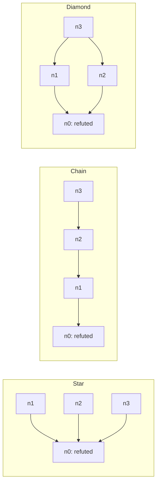

# Measuring PTPS graph operations: shared E1–E6 methodology

The question this suite answers is:

> How much time does each graph implementation take to perform the operations
> needed by PTPS, and how does that cost change as the stored graph grows?

The three measured implementations are **MORK through its Python FFI**, **MORK
through PeTTa and MeTTa**, and **Neo4j through the project's Python transaction
adapter**. A deterministic Python dictionary model checks the answers; its
speed is not measured in this suite.

See [README.md](../README.md) for the entry-point commands and
[runtime/README.md](../runtime/README.md) for the pinned runtime build. The isolated
PeTTa bridge registers its write-flush operation and evaluates comma
conjunctions using sequential native MORK matches. The source manifest and
compatibility patch record those changes; native MORK sources are unchanged.

These are application-operation measurements. They include the work needed to
use each integration, such as query evaluation, argument conversion, transport,
and construction of the returned answer. They do not measure theorem proving,
tactic execution, LLM calls, or the complete PTPS search loop. MORK FFI and
MORK–PeTTa use the same storage engine through different execution paths, so a
difference between them is not evidence about two different storage engines.

## What changed from the original FFI suite

The E numbers below belong to this **new shared suite**. An old E number does not
necessarily refer to the same experiment. Historical reports retain their
original names and must not be combined numerically with this run.

The original `mork-ffi` suite contains **E1–E7**, verified at commit
`20ce55b97a396a384346a33b85493768fde5a89e`. See the
[detailed old-to-new comparison](COMPARISON.md) for exact fixture, adapter,
index, and timing changes. The current FFI transport is retained verbatim,
but its benchmark graph adapter is different from the original `MorkView`:
incoming reads now use a maintained reverse-edge index and the common
create/insert operations have narrower preconditions and answer contracts.

| Original experiment on `mork-ffi` | Decision in the shared suite | Reason |
|---|---|---|
| E1: growth of unrelated proofs | Retained as **new E3** | Tests whether work on one proof becomes slower as other proofs accumulate. |
| E2: growth of the target proof | Retained as **new E2** | Tests sensitivity to the size of the proof being queried. |
| E3: individual operations | Standardized as **new E1** | All integrations now return the same information and perform genuine equivalent mutations. Backend-specific revision operations are excluded from this common graph contract. |
| E4: minimal FFI calls | Missing-node lookup included in **new E1** | A missing lookup is shared by all three; an FFI boundary crossing itself is not. No result is described as pure FFI overhead. |
| E5: commit latency through the commit gate | Deferred | A shared comparison needs matching validation, journal append, projection, revision advancement, and acknowledgement boundaries. The original used an in-memory journal, not a disk-durability test. |
| E6: journal recovery | Adapted as **new E6: projection rebuild** | Rebuilding from one common logical history can be specified precisely. It does not establish full crash-recovery behavior. |
| E7: memory growth/reclamation | Deferred | A proper comparison must account for the relevant runtime processes, including the Neo4j server, and distinguish peak memory from reclaimed memory. |
| Earlier added Q1: frontier | Standardized as **new E4** | Frontier queries are a useful PTPS operation; the new experiment varies eligibility rather than making every move qualify. |
| Earlier added Q2: taint cone | Standardized as **new E5** | Dependency impact is useful to PTPS; chains and reconvergent paths add coverage beyond the previous star. |
| Earlier added L1: projection/loading | Replaced by the defined phases of **new E6** | A MeTTa file load alone is not equivalent to replaying a common history across all integrations. |

## The shared data and answer contract

Each fixture represents the same **logical graph**, regardless of how a backend
stores it. Nodes have a proof namespace, a local ID, a label, and scalar fields.
Edges have a proof namespace, a local edge ID, a relationship type, and endpoint
IDs. For example:

```json
{
  "nodes": [
    {"proof": "target", "id": "n0", "label": "State",
     "fields": {"status": "open", "depth": 0}},
    {"proof": "target", "id": "n1", "label": "Move",
     "fields": {"status": "open", "depth": 1}}
  ],
  "edges": [
    {"proof": "target", "id": "e1", "rel": "PROPOSES",
     "src": "n0", "dst": "n1"}
  ]
}
```

All generated nodes belong to the committed layer. Labels are `State`, `Move`,
and `Claim`; relationships are `PROPOSES`, `SUPPORTS`, and `DEPENDS_ON`. Local IDs
are deliberately reused in different proofs. Every operation is scoped by
proof ID, so `target/n1` must never be confused with `background0/n1`.

The two MORK routes use identical atom shapes:

```text
(node proof id label)
(layer proof id committed)
(field proof id key value)
(edge proof edge-id relationship source destination)
(rev-edge proof destination relationship source edge-id)
```

The reverse-edge representation is a maintained incoming-edge index. Updating
an edge must update both edge atoms inside the measured operation. Neo4j uses
native nodes, properties, and relationships, with the adapter's native indexes.
Equal logical graphs do not imply equal physical record counts or index layouts.

| Operation | Required result or state change |
|---|---|
| Read node | `[id, label, [[field, value], ...]]`, including all agreed fields; field pairs sorted by name. |
| Read missing node | `None`; no record is created. |
| Incoming/outgoing edges | Complete `[edge-id, relationship, source, destination]` records, filtered by the requested relationship type. |
| Create node | A previously absent node, its fields, and its committed-layer membership become present. |
| Insert field | A previously absent field becomes present on an existing node. |
| Overwrite field | An existing field changes to a different value. |
| Add/remove edge | A previously absent edge is added, or a present edge is removed, including maintained indexes. |
| Frontier | Unique eligible move IDs for the specified state. |
| Dependency impact | Unique affected claim IDs, excluding the refuted root. |

Mutations acknowledge success with `True`; correctness also checks the graph
state. Returning `True` alone is not sufficient evidence that a write occurred.
Edge collections and query ID collections have no required order. Their full
contents are checked outside timing; duplicate query answers are a failure,
not silently discarded by the validator.

## E1: individual reads and mutations

**Question:** How long does one basic graph operation cost at a fixed graph size?

E1 has nine cases: node read, missing-node read, incoming edges, outgoing edges,
node creation, field insertion, field overwrite, edge insertion, and edge
removal. The full fixture contains 1,000 nodes; the quick fixture contains 100.

The graph has one state proposing all other nodes, plus one `SUPPORTS` edge from
`n1` to `n2`. The existing node probe is `n1`. Its node answer always contains
`status=open` and `depth=1`. Its incoming `PROPOSES` answer is exactly
`[e1, PROPOSES, n0, n1]`; its outgoing `SUPPORTS` answer is exactly
`[support0, SUPPORTS, n1, n2]`. Thus both edge directions return a real edge.

Each measured mutation starts from the original fixture. After timing, the
runner applies its inverse to restore that fixture:

| Timed mutation | Restoration outside timing |
|---|---|
| Create a new node with `status=open`, `depth=1` | Delete the created node and its fields/layer entry. |
| Insert `score=7` on `n1` | Delete the new `score` field. |
| Overwrite `n1.status` from `open` to `leased` | Restore `open`. |
| Add a new `SUPPORTS` edge from `n1` to `n3` | Remove that edge. |
| Remove `e1` | Recreate that original edge. |

This avoids accidentally timing repeated insertion of something that already
exists, or repeated removal of something already absent. Each timed mutation is
read back outside timing, then reversed; the restored record or edge collection
is checked before the next timed call. PeTTa validation-marker counts are also
checked so missing validation output cannot silently pass. Restoration and
checking are excluded from timing, although their cache effects can influence
the next call. These are repeated warm mutations, not a sustained
write-throughput test. PeTTa flushes queued writes before acknowledging success,
so the operation includes making its changes visible to queries.

## E2: growth within one proof

**Question:** Does work on a selected node become more expensive when the rest
of its proof grows?

Use 100, 1,000, and 10,000 target nodes in the full run, or 10 and 100 in quick
mode. At each size, measure the same node-record read, incoming-edge read,
outgoing-edge read, and existing-field overwrite used in E1. That gives 12 full
cases or 8 quick cases.

The selected node's fields, degree, IDs, and exact returned answers remain fixed.
Only the surrounding target proof grows. This control matters: a larger answer
would introduce an additional reason for a longer query. E2 is intended to
isolate sensitivity to stored graph size for these selected operations.

## E3: growth of unrelated proofs

**Question:** Does storing other proofs slow queries against an unchanged proof?

The target proof always has 100 nodes. Add 0, 1,000, and 10,000 background nodes
for the full run, or 0 and 100 for a quick run. Background proofs each contain
100 nodes and have separate namespaces. Consequently, the full run has 0, 10,
or 100 background proofs.

At each background size, measure the target node record and its incoming and
outgoing edge queries. The target fixture and exact expected answers stay
unchanged. This gives 9 full cases or 6 quick cases.

The size in E3 case names means **background nodes**. Total stored logical nodes
are that value plus 100. E2 grows the proof being queried; E3 grows other proofs.
They answer different scaling questions and should be reported separately.

## E4: eligible frontier queries

**Question:** What does finding eligible moves cost as the number of candidates
and the number of returned answers increase?

One open state proposes `C` moves. Full values of `C` are 100, 1,000, and 10,000;
quick values are 10 and 100. For each candidate count, run cases where 10%, 50%,
and 90% qualify. This gives 9 full cases or 6 quick cases. The logical node count
is `C + 1`, because the state is an additional node.

Eligible moves alternate between `open` and `reopened`. Excluded moves alternate
between `leased` and `exhausted`. The result contains only committed `Move` nodes
proposed by the requested state, with status `open` or `reopened`, and is empty
if the state status is `tainted` or `formally-closed`. Correctness tests cover
those blocked-state cases; the timed scale cases use an open state.

For example, 1,000 candidates at 10% eligibility means 1,001 logical nodes,
1,000 `PROPOSES` edges, and 100 returned IDs. At 90% eligibility the stored graph
has the same size but the result contains 900 IDs. Comparing these cases helps
separate the influence of candidate count from answer size. It does not measure
ranking a move, leasing it, or executing a tactic.

## E5: dependency-impact queries

**Question:** What does identifying affected claims cost on wide, deep, and
reconvergent dependency graphs?

The input is a refuted root claim, `n0`. Return every unique committed claim that
depends on it directly or transitively, excluding `n0` itself. A non-refuted
root produces an empty result. The direction is significant: `A DEPENDS_ON B`
means that refuting B can affect A, so the impact query traverses toward
dependents, opposite the stored dependency arrow.

For each full size `N = 100, 1,000, 10,000`, or quick size `N = 10, 100`, measure
the following three acyclic shapes:

| Shape | Edges and depth | What it exercises |
|---|---|---|
| Star | Each of the other `N−1` claims depends directly on the root; maximum depth 1. | Many immediate dependents. |
| Chain | `n1→n0`, `n2→n1`, and so on; `N−1` edges and maximum depth `N−1`. | Deep transitive reachability. |
| Reconvergent diamond | `n1` and `n2` depend on `n0`; every remaining claim depends on both `n1` and `n2`. There are `2N−4` edges and maximum depth 2. | Duplicate paths to an affected claim and correct unique answers. |

All shapes return exactly `N−1` IDs, giving 9 full cases or 6 quick cases.
The diamond uses only two root-reaching paths per leaf; it does not chain
diamonds into an exponentially growing number of paths.

Four-claim examples below show the distinction. Each arrow means **depends on**;
refuting the root affects the other three claims. The diamond's leaf is returned
once even though it has two paths to the root.



Within a fixed `N`, the answer size is identical across the three shapes, while
depth and edge count differ. As `N` increases, graph size and answer size grow
together. The current suite does **not** independently vary the affected
fraction inside a fixed-size dependency graph. Separate correctness tests cover
unrelated claims and non-dependency relationships.

This experiment reads the affected set. It does not change claim statuses,
reopen states, or append an invalidation event to the journal.

## E6: rebuilding the graph projection

**Question:** How long does it take to rebuild a queryable projection from a
defined logical operation history?

Start from an empty projection. Apply the same ordered journal: create `N`
nodes, add `N` edges, overwrite selected statuses, and remove selected existing
edges. The history uses the same operation contract as E1. It includes genuine
updates and removals rather than only initial insertion.

| Mode | Created nodes `N` | Journal operations | Final nodes | Final edges |
|---|---:|---:|---:|---:|
| Quick | 10 | 22 | 10 | 9 |
| Quick and full | 100 | 215 | 100 | 95 |
| Full | 1,000 | 2,150 | 1,000 | 950 |
| Full | 10,000 | 21,500 | 10,000 | 9,500 |

The statuses of nodes numbered `1, 11, 21, ...` are changed to `leased`. Edges
numbered `1, 21, 41, ...` are removed. The `SUPPORTS` edge remains present.
The final complete graph is checked against an independent replay by the oracle.

Each logical journal operation is applied separately. Neo4j uses one managed
transaction per operation; for example, 2,150 operations mean 2,150 managed
transactions. The FFI route invokes its canonical operation for every journal
entry, and each PeTTa operation flushes its changes. This is the agreed
application-replay policy, not the fastest possible bulk-import policy of each
engine. A future batched-rebuild comparison would be a different experiment.

The PeTTa result records executable-journal generation, graph application, and
their sum. Generation includes producing and writing the journal file; parsing
and evaluating that file belong to graph application. Its generated timing
wrapper, process launch, rule imports, and outer result-log parsing are excluded
from graph-application time. FFI and Neo4j translate entries into their
representations while applying them inside their timer. A file containing the
already-folded final snapshot is not a substitute for the defined history.

Each independent trial performs one rebuild; there are no rebuild warm-up calls
or repeated rebuilds within the same populated projection. Report elapsed time
and the journal operation count. A derived average time per journal operation
is a workload average, not the latency of any one mutation type.

This is **projection rebuild**, not a crash-recovery claim. Process startup,
crash detection, journal discovery, event validation, and reopening an existing
durable database are outside this definition. The common journal is a
prevalidated logical history constructed by the benchmark.

## Timing, validation, and repetitions

For E1–E5, a trial follows this sequence:

1. Create an isolated fixture and load the logical graph.
2. Check the operation's complete result or state change against the oracle.
3. Perform the configured warm-up calls, restoring mutations after each call.
4. Measure each requested call with a monotonic elapsed-time clock. Each sample
   is one call, including construction of its result. Read back mutations,
   restore them, and verify restoration outside the timing interval.
5. Check the resulting graph and required indexes, then clean up the fixture.

Defaults are **five independent trials**, **three warm-up calls per trial**, and
**30 measured calls per trial**. A completed E1–E5 case therefore has 150 measured
single-call samples per backend. E6 has five rebuild observations, one per trial.
Independent trials refresh the benchmark fixture/runtime; they do not flush
the operating-system caches or restart the Neo4j server. The order of backends
rotates between trials. A case/backend that fails stops its remaining repetitions;
the report preserves that failed combination and continues other workloads.

| Work | E1–E5 operation timer | E6 rebuild |
|---|---|---|
| Starting a process or establishing the initial connection | Excluded | Excluded |
| Loading the initial E1–E5 fixture | Excluded | Not applicable: starts empty |
| Converting arguments and constructing the operation's answer | Included | Included in the relevant phase |
| Maintaining forward/reverse indexes during a mutation | Included | Included |
| Neo4j managed transaction and Bolt transport | Included | Included for journal application |
| PeTTa parsing/evaluation needed to import the generated journal | Not applicable | Included in graph application |
| Correctness comparison and full validation snapshots | Excluded | Excluded |
| Undoing a timed mutation or cleaning up benchmark fixtures | Excluded | Excluded |

The PeTTa timer runs **inside the PeTTa process** and reads Python's monotonic
clock through the Python bridge. Process launch and result-log parsing by the
outer driver are excluded, but timer/bridge overhead remains in the measurement.
This overhead matters most for very short operations. FFI measurements likewise
retain timer, Python call, and adapter overhead. No timer overhead is subtracted.

The table statistic is the **median of the independent trial medians**, in
microseconds. The JSON summary also records the smallest/largest trial median
and the p95 of pooled single-call samples. Raw samples retain trial identities.
These p95 values describe **single measured calls**, unlike the older reports'
percentiles of batch means. Preflight and warm-ups are excluded. Five E6
observations are too few for strong claims about tail latency. Repeated samples
inside one trial are not independent machine-level experiments and should not
be presented as such. E6 table cells contain total rebuild time, not time per
journal entry.

A timeout, a wrong answer, an unavailable backend, and a completed measurement
are different outcomes. Retain them explicitly in the report. A timeout must
not become a zero, an estimated duration, or an omitted inconvenient result.
The runtime deadline includes setup and validation around the measured calls.
A whole-trial timeout is not necessarily a lower bound on one query's latency.

## Running the measurements

Run commands from the repository root with the project Python environment
activated. Use its Python executable explicitly if `python` is not on `PATH`,
for example `.venv/bin/python`.

Before a complete run, provide a working compiled MORK FFI library, a PeTTa
launcher that actually enables MORK, and the project's Neo4j connection settings.
`--mork-library` selects the shared native library; `--petta` selects the launcher. Record
their paths/builds with the results and use the same MORK build for both MORK
routes. Naming a PeTTa space `&mork` does not establish that MORK is active: the
runtime probe must succeed. Ordinary PeTTa results cannot fill the MORK–PeTTa
column.

```sh
# Small workload sizes, all three integrations, all six experiments.
python -m mork.bench --backend all --quick \
  --output-dir /tmp/ptps-bench-quick

# Full workload and repetition counts; uses the default isolated runtime.
python -m mork.bench --backend all \
  --scales 100,1000,10000 --repeats 5 --samples 30 --warmup 3 \
  --timeout 120 --output-dir /tmp/ptps-bench-full

# Run just one integration, retaining the common experiment definitions.
python -m mork.bench --backend mork-ffi --quick \
  --output-dir /tmp/ptps-bench-ffi
python -m mork.bench --backend mork-petta --quick \
  --output-dir /tmp/ptps-bench-petta
python -m mork.bench --backend neo4j --quick \
  --output-dir /tmp/ptps-bench-neo4j
```

Use the same options and environment for all backends in a comparison. The
default backend selection is `all`; the full reference suite contains 51 cases
per backend, and quick mode contains 37. `--quick` changes workload sizes, not
the definitions of the operations. If reducing repeats/samples for a smoke test,
record that setting and avoid presenting it as the full reference evaluation.
The example uses a 120-second whole-trial timeout; the CLI default is 60 seconds.

The experiments can also be run separately:

| Measurement | Command |
|---|---|
| E1: primitive reads and mutations | `python -m mork.bench --backend all --experiment E1 --output-dir /tmp/ptps-E1` |
| E2: growth within a proof | `python -m mork.bench --backend all --experiment E2 --output-dir /tmp/ptps-E2` |
| E3: unrelated-proof growth | `python -m mork.bench --backend all --experiment E3 --output-dir /tmp/ptps-E3` |
| E4: eligible frontier | `python -m mork.bench --backend all --experiment E4 --output-dir /tmp/ptps-E4` |
| E5: dependency impact | `python -m mork.bench --backend all --experiment E5 --output-dir /tmp/ptps-E5` |
| E6: projection rebuild | `python -m mork.bench --backend all --experiment E6 --output-dir /tmp/ptps-E6` |

`--experiment` is repeatable, for example `--experiment E4 --experiment E5`.
`--scales` changes E2, E4, E5, and E6 sizes in full mode. E1 remains fixed at
1,000 nodes, and E3 retains its fixed target/background ladder. Quick mode uses
its explicit small ladder. The CLI's `--help` is the reference for available
options; save the exact command with each evaluation.

## Runner options and saved evidence

| Option | Meaning / default |
|---|---|
| `--backend` | `all`, `mork-ffi`, `mork-petta`, or `neo4j`; default `all` |
| `--experiment` | Repeatable E1–E6 selection; default all six |
| `--quick` | Use the defined smaller workload grid |
| `--scales` | Full-mode E2/E4/E5/E6 sizes; default `100,1000,10000` |
| `--repeats` | Independent trials per successful case/backend; default 5 |
| `--samples` | Timed calls per E1–E5 trial; default 30 |
| `--warmup` | Warm-up calls per E1–E5 trial; default 3 |
| `--timeout` | Seconds for an entire worker trial; default 60 |
| `--output-dir` | Directory for the report and evidence; use a fresh directory for a new evaluation |
| `--mork-library` | Absolute path to the Rust FFI library used by both MORK routes |
| `--petta` | Real-MORK PeTTa launcher; default `scripts/bench-petta.sh` |
| `--resume` | Resume a compatible interrupted run with unchanged configuration and sources |

E6 ignores per-trial `--samples` and `--warmup`: one trial is one empty-projection
rebuild. The full configuration plans up to 765 trials: 51 cases × 3 backends ×
5 repetitions. Failures stop further repetitions of their case/backend, so the
actual recorded count can be lower.

For a custom runtime, select its library and launcher together:

```sh
BENCH_PETTA_ROOT=/absolute/path/to/PeTTa \
.venv/bin/python -m mork.bench --backend all --quick \
  --mork-library /absolute/path/to/PeTTa/mork_ffi/target/release/libmork_ffi.so \
  --petta scripts/bench-petta.sh --output-dir /tmp/ptps-custom-runtime
```

For a new run produced by the current runner, repeat its exact command with
`--resume` to continue an interruption after ensuring the earlier process has
stopped. Resume requires a compatible source layout, matching configuration,
library and launcher identity, benchmark/application sources, and the hashes of
the runtime manifest and compatibility patch. Saved runtime records are checked,
not overwritten on resume. Keep custom runtime environment variables identical
to the original invocation. Before resuming, run
`python3 scripts/setup-bench-runtime.py --check` (add
`--destination /absolute/path/to/runtime` for a custom build) to verify the
external runtime against its recorded file hashes. The resume record hashes
alone do not inspect every external runtime file. Completed trials and prior failure
decisions are retained; unfinished attempts are archived and retried. The initial
invocation refuses to overwrite a nonempty output directory.

The September 20–21 evaluation is an exception: its **older source layout is
frozen and cannot resume with the reorganized runner**. Do not add new results
to that directory. Its [freeze record](../results/common-e1-e6-2026-09-20/FROZEN.md)
explains the incomplete cells and the preserved source snapshots. A new run
must save its own evidence separately, even when the logical workloads match.

| Artifact | Contents |
|---|---|
| `results.md` | Generated experiment tables, configuration, failures, and rerun command |
| `trials.json` | Raw single-call samples, per-trial metadata, and validation status |
| `summary.json` | Aggregated medians, pooled single-call p95, and trial-median ranges |
| `environment.json` | Configuration, source/library hashes, timestamps, and run status |
| `runtime/` | Runtime source manifest and compatibility patch, when available |
| `measured-source/` | Source snapshots corresponding to recorded hashes; new runs preserve repository-relative paths |
| `artifacts/` | Exact cases, generated MeTTa programs, worker configurations, and logs; ignored by Git |

The frozen reference run additionally contains `hardware.json`,
`application-source.json`, and copied rules/adapter sources under
`application-source/`. Its original flat `measured-source/` and continuation
snapshot retain their original names so they match the recorded hashes.
Neo4j trial metadata `physical_counts` describes the initial fixture; those
counts are zero for E6, which starts empty. Top-level E6 `nodes` and `edges`
describe the independently validated final graph.

Run an already generated PeTTa program directly with:

```sh
scripts/bench-petta.sh /absolute/path/to/run/artifacts/E1_node-mork-petta-0/run.metta --silent
```

Keep the companion files in place or regenerate them after moving the repository:
generated programs import absolute paths. Their output includes initialization,
sample, mutation-validation, atom-snapshot, and completion markers. The harness
validates their contents and counts; viewing one printed sample does not perform
all correctness checks used to accept a trial.

## How to present and interpret results

Create one results table per experiment. Include all three backend columns,
the operation, logical workload size, returned answer size where applicable,
timing unit, statistic, and repetition count. Keep the raw samples and runtime
metadata so another person can reproduce the calculation.

For example, a frontier row should identify both **1,000 candidates** and
**50% eligibility / 500 returned IDs**, rather than only saying "size 1,000".
A rebuild row should identify both **created nodes** and **journal operations**.
Ratios must use the same case, statistic, clock, and measurement boundary. If
backend A takes 2 ms and B takes 5 ms, B takes 2.5 times as long for that case;
that does not imply PTPS as a whole is 2.5 times slower.

The earlier reports measured different operations, ordinary PeTTa rather than
MORK, or different clocks/batching. Keep them as historical exploratory results.
Run all three current integrations under the shared definitions before making
a new paired comparison. This methodology document itself contains no invented
performance results.

## Limits and later experiments

The synthetic graphs deliberately control size and shape. They do not establish
performance on every real proof graph. All generated nodes are committed; the
suite does not measure a mixture of committed and speculative layers. The
dependency fixtures are acyclic, and their affected fractions are fixed. The
suite measures one caller at a time, not concurrent contention or maximum
throughput. Warm reads and repeated reversible mutations do not characterize
cold-cache behavior. Record machine configuration, runtime versions, indexes,
other server data, and any concurrent activity when interpreting a run.

The integrations can use different algorithms: FFI may combine MORK matches in
Python, PeTTa evaluates MeTTa rules, and Neo4j executes Cypher. Neo4j's native
transaction commit and transport are included. MORK's in-memory mutation does
not automatically offer the same durability. Consequently, the write rows
compare graph-operation costs with their documented guarantees; they do not
rank equivalent durable-commit implementations.

The original **E5 commit experiment** remains a separate future extension. It
needs one agreed commit protocol and acknowledgement point across all three
integrations. The original **E7 memory experiment** also remains a future
extension, with full process accounting, a defined baseline, and separate
measurements of peak usage and reclamation. Neither durable commits, full crash
recovery, nor memory efficiency should be claimed from the current E1–E6 tables.
